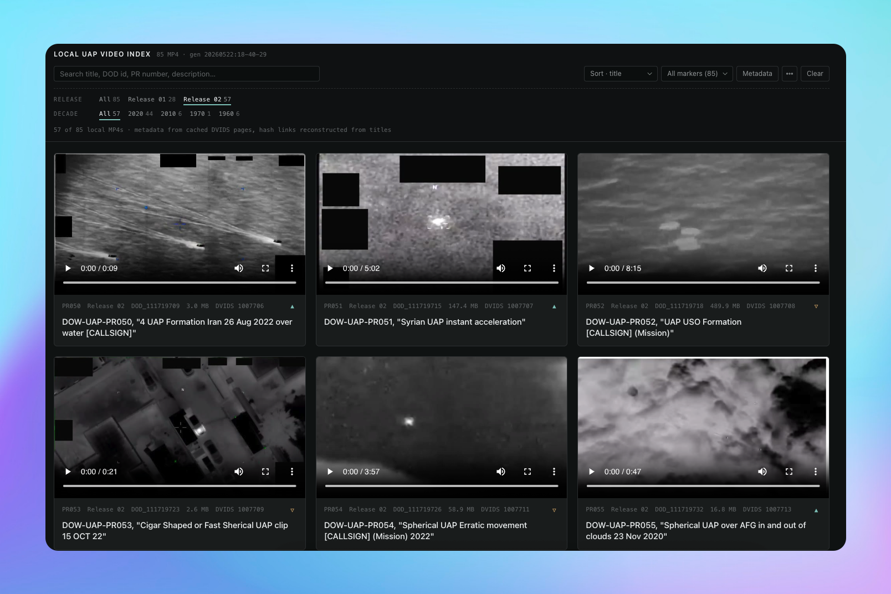

# Local UAP Video Index

This repo provides a local viewer for MP4 downloads from `war.gov/UFO`, grouped by release, with a generated `index.html` page for browsing, searching, filtering, sorting, and playing videos without pagination or modals.

Clone the repo, download each release into the folders below, and open `index.html` in your browser.

Release 1: https://d34w7g4gy10iej.cloudfront.net/uapvideos.zip  
Release 2: https://d34w7g4gy10iej.cloudfront.net/uap052226.zip



## Folder Structure

Keep videos in release-specific folders:

```text
uap052226/
  release_01/
    DOD_111688723.mp4
    DOD_111688762.mp4
    ...
  release_02/
    video_2605_DOD_111719709_DOD_111719709.mp4
    video_2605_DOD_111719715_DOD_111719715.mp4
    ...
  thumbnails/
    DOD_111688723.jpg
    DOD_111719709.jpg
    ...
  index.html
  uap-local-index.json
  README.md
```

For future releases, create the next folder using the same naming pattern:

```text
release_03/
release_04/
```

Put downloaded MP4s directly inside that release folder. The filename only needs to contain a `DOD_#########` id somewhere in it.

## Opening The Viewer

Open `index.html` directly in a browser. No server is required.

The page embeds every local MP4 as a playable video card and uses generated thumbnails from `thumbnails/` when available.

## Page Controls

- Search filters by title, DOD id, PR number, description, and filename.
- Video markers are saved in the browser using `localStorage`, keyed by DOD id.
- The marker cycles from neutral to favorite to thumbs-down to neutral.
- The marker dropdown filters to Faves, Dislikes, or Unfaved videos and shows counts.
- Faves import/export saves or imports marker JSON for moving markers between browsers or machines.
- Release pills show all videos or only one release, with counts.
- Decade pills filter by `date_taken`, with counts.
- Sort changes ordering by title, date taken, file size, or DOD id.
- Show metadata toggles all metadata on or off.
- Clicking a card's top metadata strip or title shows metadata for every card in that grid row.
- Press `f` to fullscreen and play the most recently selected, hovered, focused, or played video.
- Press Space to play or pause the active video.
- Typing in search automatically shows metadata and highlights the search term in pale yellow.
- Clear resets search and filters.

When search or filters change, the page scrolls back to the top of the results.
